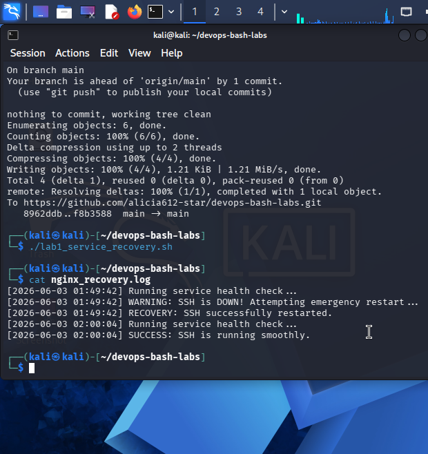
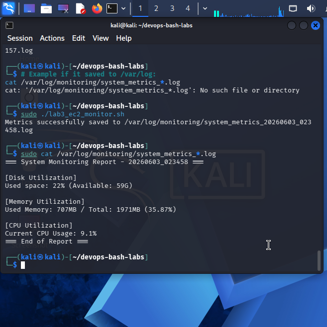
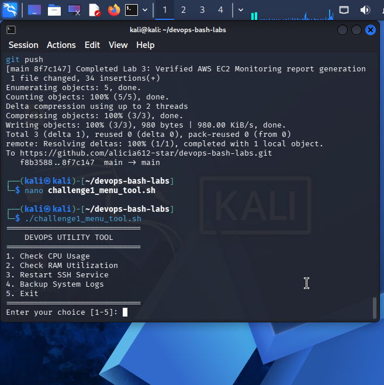
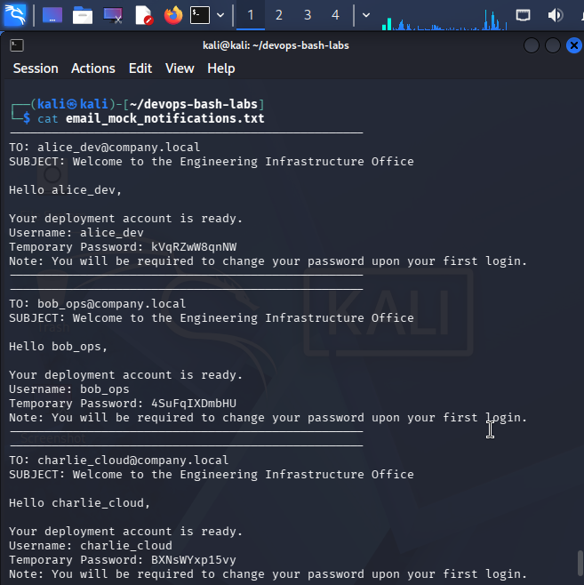

# DevOps Automated Infrastructure Solutions: Bash Scripts Lab

This repository contains lightweight, efficient Bash scripts designed to automate system administration and monitoring routines.

## Executing the Scripts

Before running any script, make sure they have executive access permissions enabled:

```bash
chmod +x *.sh

Core Automation Scripts Matrix
1. Production Service Recovery Agent (lab1_service_recovery.sh)
Description: Periodically audits the state of target core daemons and triggers automated self-healing remediation routines if a service failure state is detected.

Environment Pivot Note: Originally configured to monitor Nginx. Due to upstream package repository mirror connection timeouts (404 fetching blocks), the script target was dynamically shifted to the local SSH daemon. The underlying script tracking logic remains identical.

Execution:

Bash
sudo ./lab1_service_recovery.sh
Output Verification: Telemetry tracking history is systematically appended directly to ./nginx_recovery.log.

2. AWS EC2 Instance Resource Monitor (lab3_ec2_monitor.sh)
Description: Synthesizes low-level Linux diagnostic utilities (df, free, top) to extract lightweight performance snapshots of storage block volumes, memory buffers, and computational processor loads.

Execution:

Bash
./lab3_ec2_monitor.sh
Output Verification: Formatted report files are dynamically generated and dumped with localized ISO timestamps under /var/log/monitoring/ (or local fallback directories).

3. Interactive Sysadmin Utility UI (challenge1_menu_tool.sh)
Description: An interactive command-line dashboard interface featuring clean structural loops and case evaluations to let operators execute hardware diagnostics, service restarts, and log archiving routines safely.

Execution:

Bash
./challenge1_menu_tool.sh
Output Verification: Interactive outputs print directly to the workspace console terminal. Log backups are exported as compressed .tar.gz files inside the ./backup_logs/ folder.

4. Automated Identity Management Onboarding (challenge2_onboarding.sh)
Description: Parses an input registry file (users.txt), provisions home profile architectures, seeds cryptographically secure alphanumeric strings via OpenSSL, and forces credential rotation flags (chage -d 0) upon the initial system login boundary.

Execution:

Bash
sudo ./challenge2_onboarding.sh
Output Verification: Generates simulated corporate email notification dispatch logs inside email_mock_notifications.txt located in the root workspace folder.
---

## Lab Execution Verification Proofs

### Lab 1 — Service Recovery Telemetry Log View
*Displays the active service validation states and successful remediation notifications.*


### Lab 3 — System Infrastructure Performance Summary
*Displays the compiled text-parsed resource reports detailing Disk, Memory, and CPU metrics.*


### Challenge 1 — Sysadmin Interactive Interface Loop
*Displays the functional DevOps Utility UI menu layout inside the active terminal workspace.*


### Challenge 2 — Simulated IAM Accounts Provisioning Output
*Displays the generated mock email notifications mapping credentials and access compliance flags.*


---

## Auxiliary Step-by-Step Test Logs

The following supporting screenshots document isolated execution stages, targeted menu sub-options, and targeted system notifications captured during development:

| Test Phase | Step Description | Auxiliary Evidence Link |
| :--- | :--- | :--- |
| **Lab 1 Failover** | Emergency Restart Notification Trigger | [View Crash Alert](assets/notif.png) |
| **Challenge 1 UI** | Menu Option 1 & 2 (CPU/RAM Live Stats) | [View Stat Execution](assets/option1-2.png) |
| **Challenge 1 UI** | Menu Option 4 & 5 (Log Compression & Exit) | [View Backup Archive](assets/option4-5.png) |
| **Challenge 2 IAM** | Active Useradd Profile Creation Loops | [View Provisioning Loop](assets/onboarding.png) |
